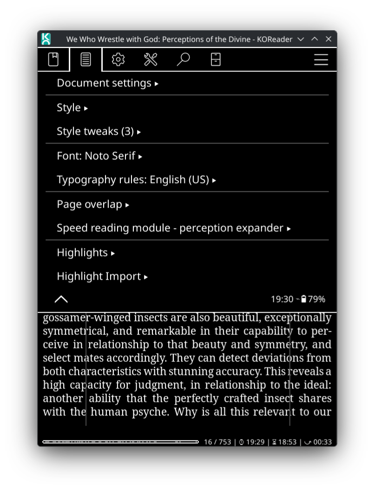
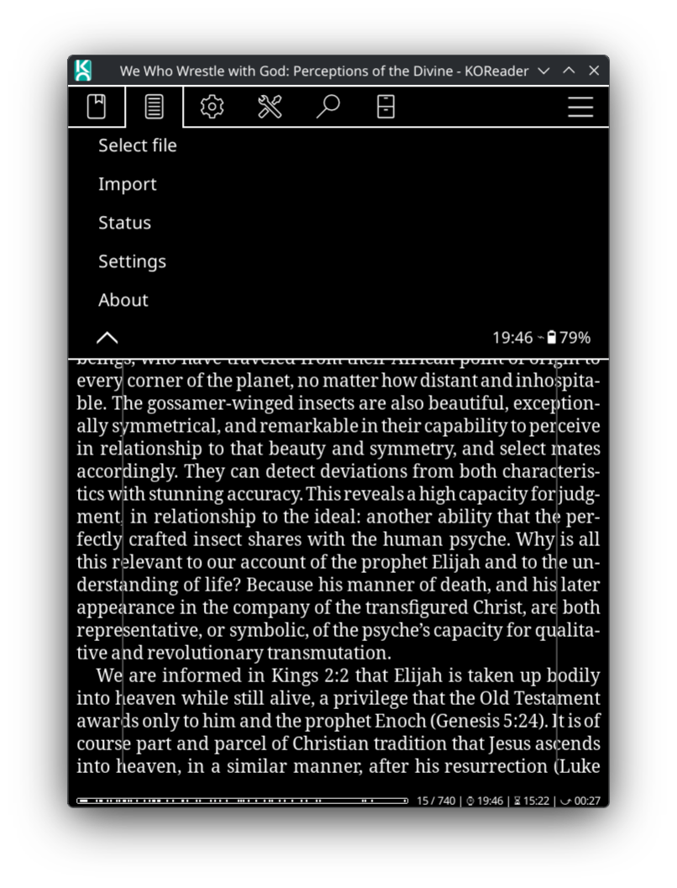
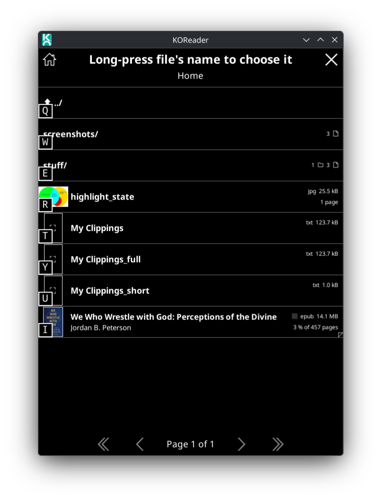
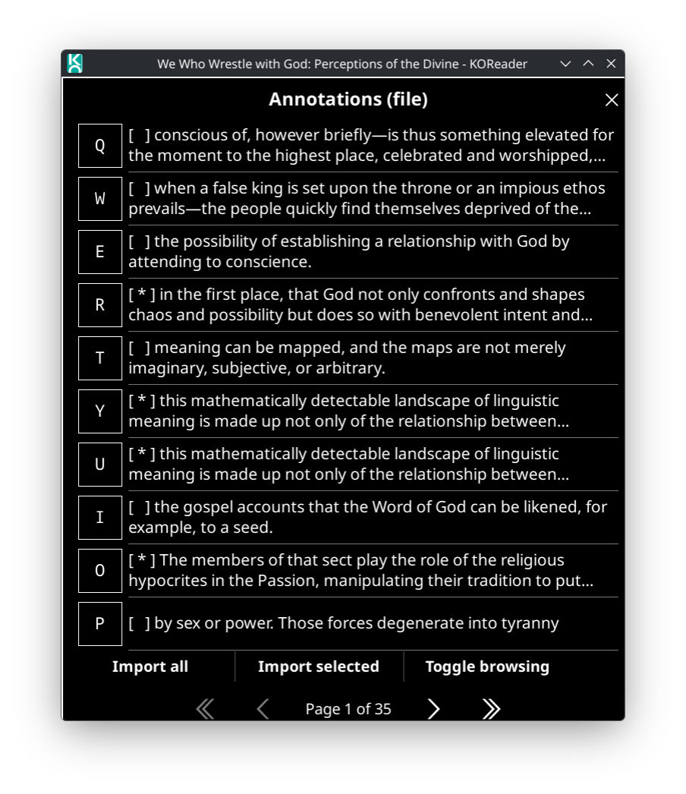
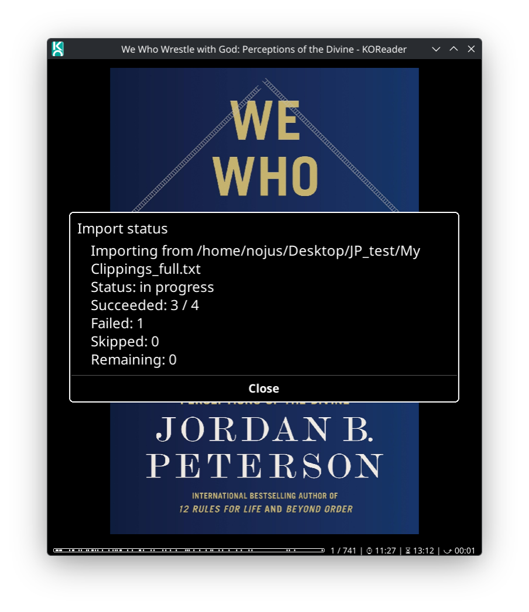
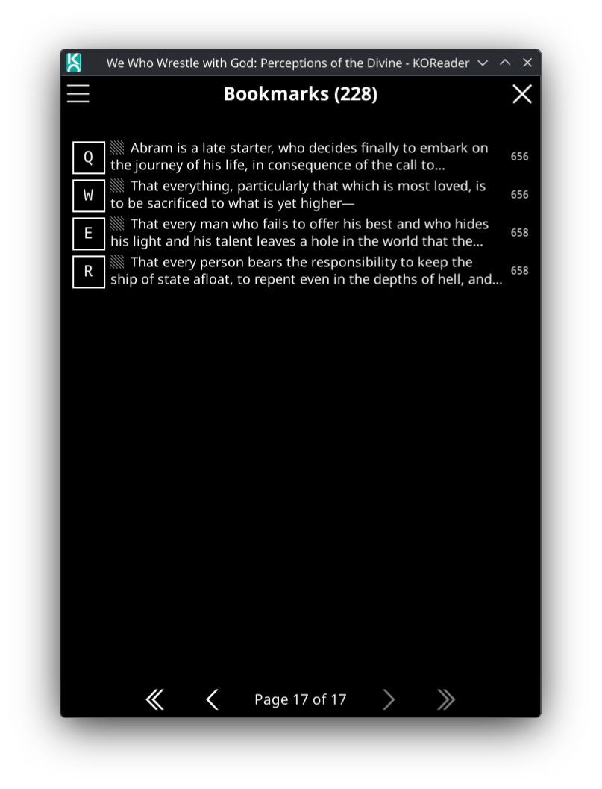

# HighlightImport Plugin for KOReader

Import your Kindle highlights from "My Clippings.txt" directly into KOReader.

## Features

- Import highlights from Kindle's "My Clippings.txt" file
- Automatic text matching and highlight creation
- Support for multi-line highlights

## Tested Platforms

- **OS**: KDE neon User Edition 24.04 (Noble)
- **KOReader**: v2025.08

The plugin should work on any platform that supports KOReader, including:
- Linux Desktop
- E-ink readers (Kindle, Kobo, etc.)
- Android devices
- Other supported platforms

## Installation

### Method 1: Manual Installation (Recommended)

1. **Locate your KOReader plugins directory**:
   - **Linux**: `~/.config/koreader/plugins/` or `~/.var/app/rocks.koreader.KOReader/config/koreader/plugins/`
   - **Android**: `/sdcard/koreader/plugins/`
   - **E-ink devices**: Usually in the KOReader installation folder

2. **Download the plugin**:
   ```bash
   cd ~/.config/koreader/plugins/
   # Or for Flatpak:
   cd ~/.var/app/rocks.koreader.KOReader/config/koreader/plugins/
   
   git clone https://github.com/nojux-official/HighlightImport.koplugin.git
   ```

3. **Restart KOReader** to load the plugin

4. **Verify installation**:
   - Open any book in KOReader
   - Tap the top menu → **Typesetting** (or **Tools**)
   - You should see **Highlight Import** in the menu

### Method 2: Download ZIP

1. Download the plugin as a ZIP file from the [releases page](https://github.com/nojux-official/HighlightImport.koplugin/releases)
2. Extract the ZIP file
3. Copy the `HighlightImport.koplugin` folder to your KOReader plugins directory
4. Restart KOReader

## Usage

### Step 1: Prepare Your Highlights

1. Connect your Kindle to your computer
2. Navigate to `documents/My Clippings.txt`
3. Copy this file to your device where KOReader is installed

### Step 2: Open Your Book

1. Open the book in KOReader that matches your Kindle highlights
2. **Important**: Scroll through the entire book from beginning to end
   - This preloads the book's content into memory
   - Without this step, text matching may fail
   - You can page through quickly; just ensure all pages are briefly displayed

### Step 3: Access the Plugin Menu

1. Tap the **top menu** to open the main menu
2. Navigate to **Typesetting** (the icon with lines)
3. Find and tap **Highlight Import**





### Step 4: Select the My Clippings File

1. In the Highlight Import menu, tap **1. Select file**
2. Navigate to your `My Clippings.txt` file location
3. **Long press** on the file to select it



### Step 5: Import Highlights

1. Open the **Highlight Import** menu again (from Typesetting menu)
2. Tap **>Import<** (the second menu item - the button text changes to show it's ready)
3. You can select which highlights to import in the next screen, or just tap "Import All"
   


4. Wait for the import process to complete
   - This may take a few seconds depending on the number of highlights and book size



### Step 6: View Your Highlights

1. Tap the **top menu**
2. Tap the **Bookmarks** icon (bookmark symbol)
3. Your imported Kindle highlights will appear alongside any existing KOReader highlights



## Important Notes

### Text Matching

- **Exact match only**: The plugin currently only imports highlights that exactly match the text in the book


## Troubleshooting

### No highlights imported

1. **Check file format**: Ensure you're using Kindle's "My Clippings.txt" format
2. **Preload content**: Scroll through the entire book before importing
3. **Check logs**: Look for error messages in KOReader's logs

## File Format

The plugin expects Kindle's standard "My Clippings.txt" format:

```
[Highlight text content]
==========
Book Title (Author Name)
- Your Highlight on Location 123-456 | Added on Wednesday, July 9, 2025 10:43:50 AM

[Next highlight...]
==========
```

## Contributing

Contributions are welcome! Please feel free to submit issues or pull requests.

### Development Setup

1. Clone the repository
2. Make your changes
3. Test thoroughly on your device
4. Submit a pull request

## License

This project is licensed under the MIT License - see the [LICENSE](LICENSE) file for details.

## Credits

**Author**: [nojux-official](https://github.com/nojux-official)

**Acknowledgments**:
- Built on [KOReader](https://github.com/koreader/koreader)'s plugin architecture
- `clip.lua` parser adapted from KOReader's [exporter.koplugin](https://github.com/koreader/koreader/tree/master/plugins/exporter.koplugin)
- Inspired by the KOReader community's need for Kindle highlight import functionality


## Support

- **Issues**: [GitHub Issues](https://github.com/nojux-official/HighlightImport.koplugin/issues)
